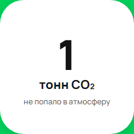
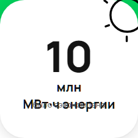
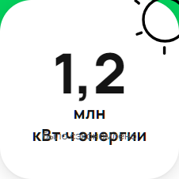
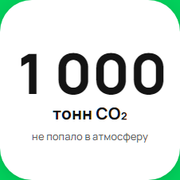
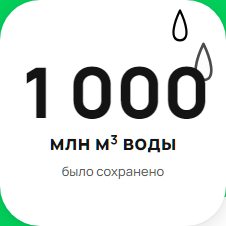
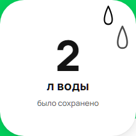
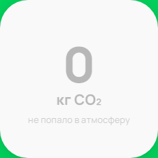

# Баг-репорты
## Выявлены при тестировании функционала калькуляторов экологического вклада на [странице](https://www.avito.ru/avito-care/eco-impact).

В описании баг-репортов отсутствуют предусловия. Баги воспроизведены в браузере _chromium_.

## Баг№1
| Описание              | 1. При значении счетчика CO2 "1 тонна" отображается "1 тонн" - не учитывается склонение.                                                                                                                                                                                                      |
|-----------------------|-----------------------------------------------------------------------------------------------------------------------------------------------------------------------------------------------------------------------------------------------------------------------------------------------|
| Приоритет             | Low                                                                                                                                                                                                                                                                                       |
| Шаги воспроизведения  | 1. Перейти на страницу https://www.avito.ru/avito-care/eco-impact .   2. Дождаться частичной загрузки контента, перехватить init.   3. Подменить ответ от сервера: заменить значение ключа "co2" на 1000.   5. Осуществить скриншот каждого счетчика .   6. Открыть скриншот. |
| Фактический результат | На скриншоте значение счетчика CO2 отображается как "1 тонн".                                                                                                                                                                                                                                 |
| Ожидаемый результат   | Значение счетчика CO2 отображается как "1 тонна".                                                                                                                                                                                                                                             |
| Вложения              |                                                                                                                                                                                                                                                         |                                                                                                                                                                                                                                                                                                                           |

## Баг№2
| Описание              | 2. При значениях счетчиков = 9_999_999_999 и в подобных случаях, микросервис округляет значения до целых чисел, 10 млн МВт*ч энергии вместо 9,9 млн МВт*ч энергии", 10 млн м3 воды вместо 9,9 млн м3, 10 млн тонн CO2 вместо 9,9 млн тонн CO2".                                       |
|-----------------------|-----------------------------------------------------------------------------------------------------------------------------------------------------------------------------------------------------------------------------------------------------------------------------------------------------------------------------------|
| Приоритет             | Low                                                                                                                                                                                                                                                                                                                           |
| Шаги воспроизведения  | 1. Перейти на страницу https://www.avito.ru/avito-care/eco-impact .   2. Дождаться частичной загрузки контента, перехватить init.   3. Подменить ответ от сервера: заменить значение ключа "energy" на 9_999_999_999.   4. Сделать скриншоты счетчиков из блока "Ваш экологический вклад".   5. Открыть скриншот. |
| Фактический результат | На скриншоте значение счетчика энергии отображается как "10 млн МВт`*`ч энергии".                                                                                                                                                                                                                                                 |
| Ожидаемый результат   | На скриншоте значение счетчика энергии отображается как "9,9 млн МВт`*`ч энергии".                                                                                                                                                                                                                                                |
| Вложения              |                                                                                                                                                                                                                                                                                            |

## Баг№3
| Описание              | 3. При сокращении записи электроэнергии при значениях более 1_000_000  перекрывается надпись "было сэкономлено".                                                                                                                                                                                                                       |
|-----------------------|----------------------------------------------------------------------------------------------------------------------------------------------------------------------------------------------------------------------------------------------------------------------------------------------------------------------------------------|
| Приоритет             | Medium                                                                                                                                                                                                                                                                                                                                  |
| Шаги воспроизведения  | 1. Перейти на страницу https://www.avito.ru/avito-care/eco-impact .   2. Дождаться частичной загрузки контента, перехватить init.   3. Подменить ответ от сервера: заменить значение ключа "co2" на 1_200_000.   4. Сделать скриншот страницы со счетчиками из блока "Ваш экологический вклад".   5. Открыть скриншот. |
| Фактический результат | В счетчике CO2 надпись "МВт`*`ч энергии" перекрывает текст "было сэкономлено".                                                                                                                                                                                                                                                         |
| Ожидаемый результат   | В счетчике CO2 надпись "МВт`*`ч энергии" находится над текстом "было сэкономлено", оба текста видимы и не перекрывают друг друга.                                                                                                                                                                                                      |
| Вложения              |                                                                                                                                                                                                                                                                                                 |

## Баг№4
| Описание              | 4. При подстановке значений счетчиков  = 999_999, на UI отображается "1000 тонн CO2" вместо "1 тыс тонн CO2", "1000 МВт*ч" вместо "1 ГВт*ч" , "1000 м3 воды" вместо "1 тонна м3 воды". И вместо представления "999,9" происходит округление до целых.                                                        |
|-----------------------|------------------------------------------------------------------------------------------------------------------------------------------------------------------------------------------------------------------------------------------------------------------------------------------------------------------------------------|
| Приоритет             | Low                                                                                                                                                                                                                                                                                                                            |
| Шаги воспроизведения  | 1. Перейти на страницу https://www.avito.ru/avito-care/eco-impact .   2. Дождаться частичной загрузки контента, перехватить init.   3. Подменить ответ от сервера: заменить значения счетчиков на 999_999.   4. Сделать скриншот страницы со счетчиками из блока "Ваш экологический вклад".   5. Открыть скриншот. |
| Фактический результат | На скриншоте значение счетчика CO2 отображается как "1000 тонн CO2".                                                                                                                                                                                                                                                               |
| Ожидаемый результат   | На скриншоте значение счетчика CO2 отображается как "1 тыс тонн СО2".                                                                                                                                                                                                                                                              |
| Вложения              |                                                                                                                                                                                                                                                                                             |

## Баг№5
| Описание              | 5. При подстановке значений счетчиков = 999_999_999_999, на UI отображается "1000 млн тонн CO2" вместо "1 млрд  тонн CO2", "1000 млн МВт*ч" вместо "1 ПВт*ч или 1 млн ГВт*ч или 1 млрд МВт*ч" , "1000 млн м3 воды" вместо "1 млрд м3 воды". И вместо представления "999,9 *106" происходит округление до целых. |
|-----------------------|--------------------------------------------------------------------------------------------------------------------------------------------------------------------------------------------------------------------------------------------------------------------------------------------------------------------------------------------------|
| Приоритет             | Low                                                                                                                                                                                                                                                                                                                                          |
| Шаги воспроизведения  | 1. Перейти на страницу https://www.avito.ru/avito-care/eco-impact .   2. Дождаться частичной загрузки контента, перехватить init.   3. Подменить ответ от сервера: заменить значения счетчиков на 999_999_999_999.   4. Сделать скриншот страницы со счетчиками из блока "Ваш экологический вклад".   5. Открыть скриншот.       |
| Фактический результат | На скриншоте значение счетчика воды отображается как "1000 млн м3 воды".                                                                                                                                                                                                                                                                         |
| Ожидаемый результат   | На скриншоте значение счетчика воды отображается как "1 млрд м3 воды".                                                                                                                                                                                                                                                                           |
| Вложения              |                                                                                                                                                                                                                                                                                                           |

## Баг№6 
| Описание              | 6. При подстановке значений счетчиков = 1.5 , на UI отображается "2 кг CO2" вместо "1,5 кг CO2", "2 кВт*ч" вместо "1,5 кВт*ч" , "2 л воды" вместо "1,5 л воды".                                                                                                                                                                |
|-----------------------|--------------------------------------------------------------------------------------------------------------------------------------------------------------------------------------------------------------------------------------------------------------------------------------------------------------------------------|
| Приоритет             | Hight                                                                                                                                                                                                                                                                                                                        |
| Шаги воспроизведения  | 1. Перейти на страницу https://www.avito.ru/avito-care/eco-impact .   2. Дождаться частичной загрузки контента, перехватить init.   3. Подменить ответ от сервера: заменить значения счетчиков на 1.5.   4. Сделать скриншот страницы со счетчиками из блока "Ваш экологический вклад".   5. Открыть скриншот. |
| Фактический результат | На скриншоте значение счетчика воды отображается как "2 л".                                                                                                                                                                                                                                                                    |
| Ожидаемый результат   | На скриншоте значение счетчика воды отображается как "1,5 л".                                                                                                                                                                                                                                                                  |
| Вложения              |                                                                                                                                                                                                                                                                                         |

## Баг№7
| Описание              | 7. При подстановке значений счетчиков = 0.3 , на UI отображается "0 кг CO2" вместо "0,3 кг CO2", "0 кВт*ч" вместо "0,3 кВт*ч" , "0 л воды" вместо "0,3 л воды".                                                                                                                                                                |
|-----------------------|--------------------------------------------------------------------------------------------------------------------------------------------------------------------------------------------------------------------------------------------------------------------------------------------------------------------------------|
| Приоритет             | Hight                                                                                                                                                                                                                                                                                                                       |
| Шаги воспроизведения  | 1. Перейти на страницу https://www.avito.ru/avito-care/eco-impact .   2. Дождаться частичной загрузки контента, перехватить init.   3. Подменить ответ от сервера: заменить значения счетчиков на 0.3.   4. Сделать скриншот страницы со счетчиками из блока "Ваш экологический вклад".   5. Открыть скриншот. |
| Фактический результат | На скриншоте значение счетчика CO2 отображается как "0 кг CO2".                                                                                                                                                                                                                                                                |
| Ожидаемый результат   | На скриншоте значение счетчика CO2 отображается как "0,3 кг CO2".                                                                                                                                                                                                                                                              |
| Вложения              |                                                                                                                                                                                                                                                                                         |
